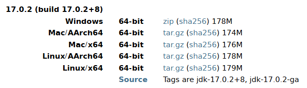
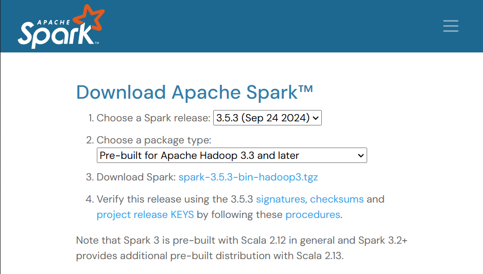
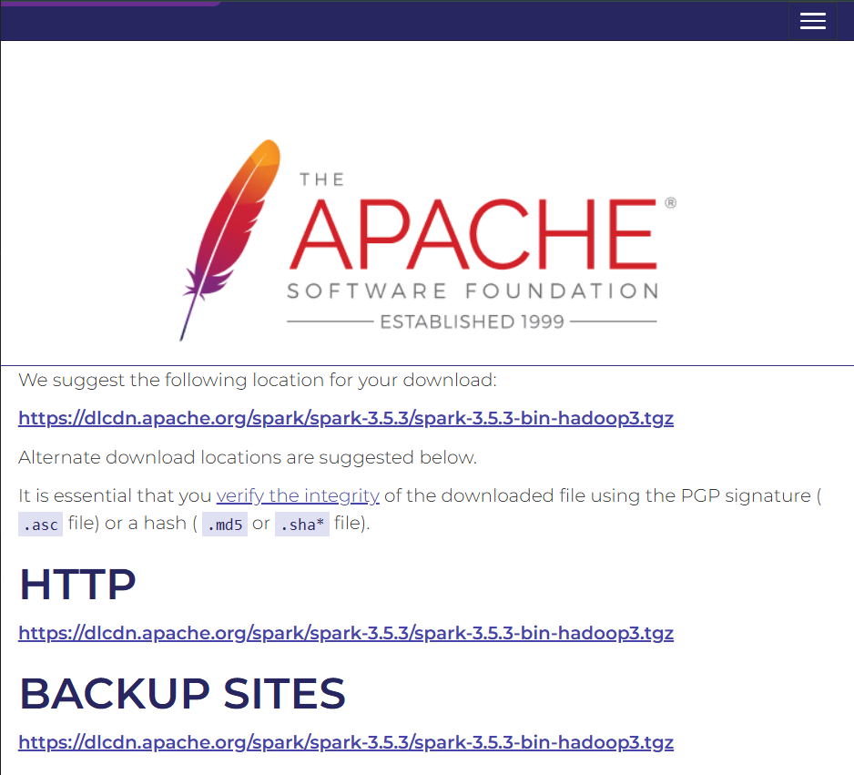
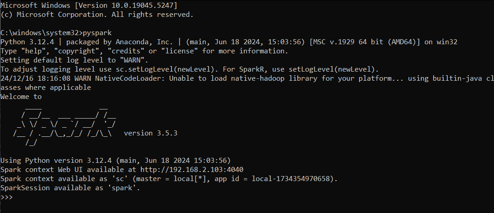

# PySpark EDA Netflix Movies and TV Shows
Using PySpark, an Exploratory Data Analysis (EDA) on Netflix Movies and TV Shows Dataset. This project falls under the *Asssignment # 3* of **CE408 - Cloud and Distributed Computing** by *Nauman Asif*.

## Overview
In this project, PySpark has been used to conduct EDA on the Netflix Movies and TV SHows Dataset. This analysis included insights such as:
- Data Preprocessing with PySpark.
- Looking into the Summary Statistics.
- The Distribution of the Dataset.
- Filteration of Movies and TV Shows.

## Dataset
The Dataset used for this Analysis is available on [kaggle.com](https://www.kaggle.com/datasets/victorsoeiro/netflix-tv-shows-and-movies/data) and contains 2 different types of csv files.
- credits.csv
- titles.csv

The file used for this Analysis was the latter one because it contains details about the movies and tv shows and has columns such as:
- title
- type
- description
- release_year
- age_certification
- etc

## Pre-Requisites
- Windows 10 or 11
- User with Administrator privileges
- Access to Command Prompt or PowerShell
- WinRAR or 7-zip to extract .tar files
- Python 3.x
- Jupyter

## Setup Instructions
1. Go [jdk.java.net/archive/](https://jdk.java.net/archive/) and download OpenJDK 17.0.2


2. Extract the zip file and move it to  C:\Java

4. Download latest Apache Spark release. [spark.apache.org/downloads](https://spark.apache.org/downloads.html)

5. The latest Spark version is selected by default. At the time of writing, the latest version is Spark 3.5.3 for Hadoop 3.3

6. Click the spark-3.5.3-bin-hadoop3.tgz download link.


7. Select a location from a list of mirror servers to begin the download.


8. Create a new Spark folder in the root of the C: drive using the following command:

   ```bash
   cd \ && mkdir Spark
   ```
   
9. Use 7-zip or WinRAR to extract the Spark *.tar* file from the *.tgz* compressed file and place it in the *Spark* folder.

10. Extract the Spark binaries from the Spark *.tar* file.

11. Create a hadoop\bin folder in the C: drive to store the *winutils.exe* file:

   ```bash
   cd \ && mkdir C:\hadoop\bin
   ```

12. Use the **curl** command to download the file from the winutils GitHub repository into the newly created folder:

   ```bash
   curl --ssl-no-revoke -L -o C:\hadoop\bin\winutils.exe https://github.com/cdarlint/winutils/raw/master/hadoop-3.3.5/bin/winutils.exe
   ```

13. Add the Spark, Java, and Hadoop locations to your system's Path environment variable to run the Spark shell directly from the CLI.
    - Use the setx command to set the SPARK_HOME User Variable:
   
      ```bash
      setx SPARK_HOME "C:\Spark\spark-3.5.5-bin-hadoop3"
      ```

    - To set HADOOP_HOME, enter:

      ```bash
      setx HADOOP_HOME "C:\hadoop"
      ```

    - To set JAVA_HOME, type:

      ```bash
      setx JAVA_HOME "C:\Java\jdk-17.0.2"
      ```

    - Enter the following command to retrieve the current Path from the registry and store it in the oldPath variable:

      ```bash
      for /f "tokens=2*" %A in ('reg query "HKCU\Environment" /v Path') do set "oldPath=%B"
      ```

    - Append the Spark, Hadoop, and Java paths to the Path variable without overwriting existing entries:

      ```bash
      setx Path "%oldPath%;%SPARK_HOME%\bin;%HADOOP_HOME%\bin;%JAVA_HOME%\bin"
      ```

14. Enter the following command to run Spark using Python:

   ```bash
   pyspark
   ```


